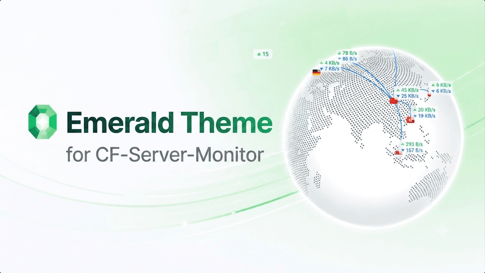

<h1 align="center">Emerald Theme for Monitor</h1>

<p align="center">为 <a href="https://github.com/monitor-probe/monitor">monitor</a>（Rust 探针）移植的 Emerald 主题，基于 Vue 3 + Vite + reka-ui + Tailwind CSS v4</p>

<p align="center"></p>

> 移植自 [Tokinx/cf-server-monitor-theme-emerald](https://github.com/Tokinx/cf-server-monitor-theme-emerald)（CF-Server-Monitor 主题，MIT 协议）。原主题针对 CF-Server-Monitor 的 API 构建，本仓库已将其完整适配到 monitor 的 API、WebSocket 协议与主题格式。

## 功能

- 卡片 / 表格两种节点视图，多分组、搜索
- 深色、浅色、跟随系统三种主题模式
- 地球 / 地图节点分布
- CPU、内存、磁盘、流量、Ping 历史图表
- WebSocket 实时更新与断线重连
- 主题设置：默认视图、公告、访客信息、备案号、自定义背景等（在 monitor 后台的主题配置中修改）

## 开发

```bash
bun install
# 本地开发（将 /api 与 WebSocket 代理到本地 hub）
bun run dev
# 构建，产物在 dist/
bun run build
```

## 安装到 hub

一个可安装主题是一个目录，名字必须与 `theme.json` 的 `short` 相同：

```text
<themes-dir>/emerald/
├── theme.json
├── preview.png
└── dist/
    └── index.html
```

```bash
sudo mkdir -p /opt/monitor/data/themes/emerald
sudo cp theme.json preview.png /opt/monitor/data/themes/emerald/
sudo cp -r dist /opt/monitor/data/themes/emerald/
sudo chown -R monitor:monitor /opt/monitor/data/themes/emerald
```

然后在 monitor 后台切换主题为 `emerald` 即可。

## License

MIT（原作者 [Tokinx](https://github.com/Tokinx)），见 [LICENSE](./LICENSE)。
